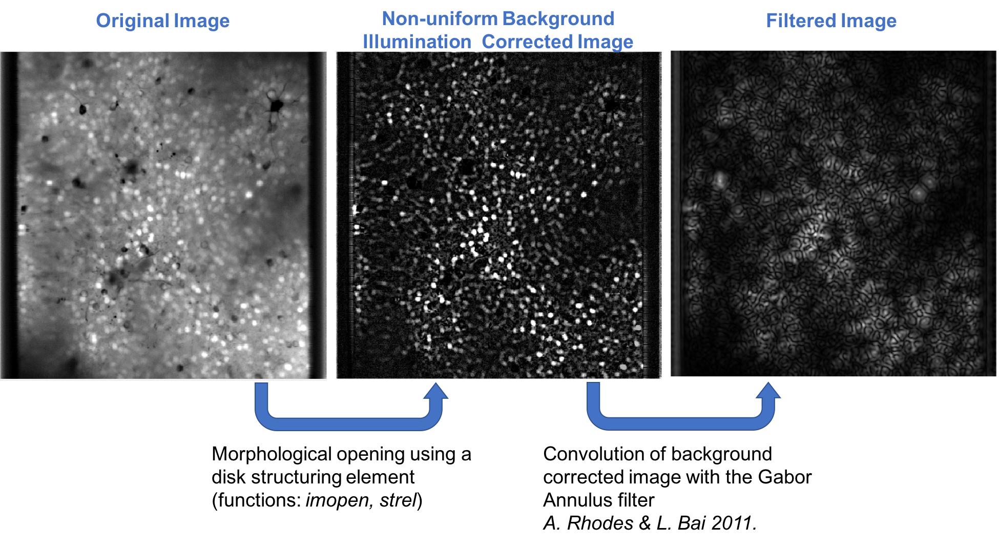
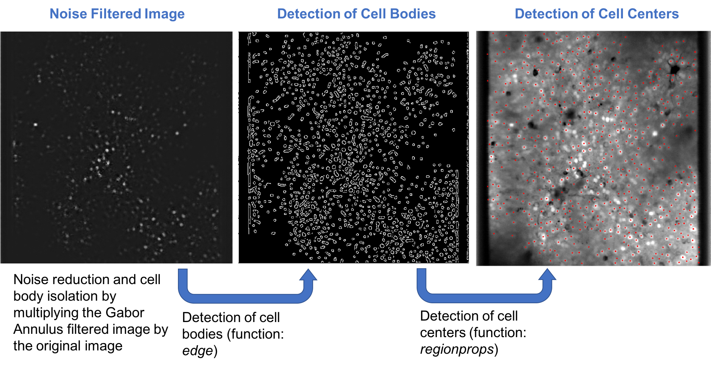
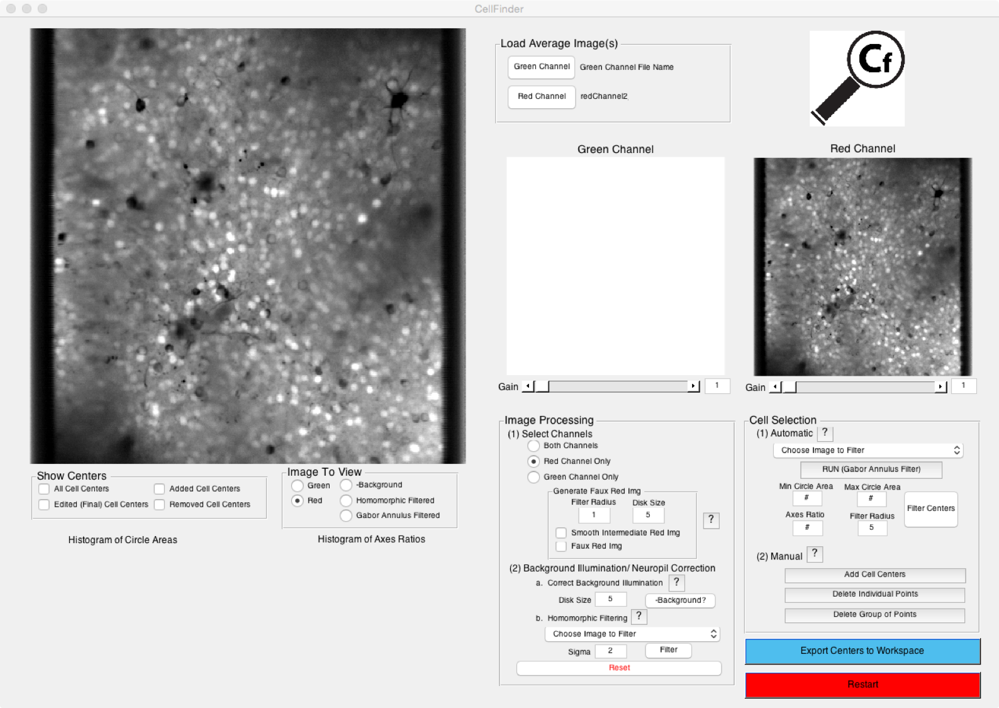

**CellFinder** is a MATLAB based graphical user interface that allows users to detect the centers of neurons in two-photon calcium images in a semi-unsupervised manner. Driving cell detection in **CellFinder** is the Gabor Annulus filter, a circlular variation of the Gabor wavelet where the complex wavelet radiates from the center of the filter rather than bisecting the center as a plane (fig. 1). Cell detection by the Gabor Annulus filter was first demonstrated by A. Rhodes and L. Bai in their paper entitled "Circle Detection Using a Gabor Annulus" (Proceedings of the 22nd British Machine Vision Conference. Dundee, UK, 2011). Implimentation of this technique minimizes the time needed to preprocess images and avoids the use of machine learning algorithms that require large training data sets or expensive computing hardware such as GPUs.

Figure 1. Gabor filter examples. (left) Example of a Gabor wavelet with a single orientation. (right) Example of the imaginary and real components of the Gabor Annulus filter, orientation invarient. Adapted from Rhodes et. al.

# Approach
The approach used by **CellFinder** deviates slightly from the approach used by A. Rhodes and L. Bai. Instead of detecting the centers of cells by eroding the filtered image and declaring bright isolated regions as the center of cells, we multiplied the Gabor Annulus filtered image with the original (background ilumination homogenized) image (fig. 2). The result is a noise reduced image with isolated cell bodies. The perimeter of each cell body is identified using MATLAB's *edge* function. The pixels within each closed object in the edge detected image are compiled and stored in a structure (function: *bwconncomp*). The cell centers are computed for each object using the *regionprops* function and are plotted in the main dashboard window. The data created by **CellFinder** can be outputted to the workspace for use in personal analysis pipelines designed to extract the fluorescence time series of each cell during an experiment.

 
Figure 2. Image processing pipeline.

# Dashboard
The **CellFinder** dashboard includes multiple plotting windows that allow the user to view processed and unprocessed images, set criteria for cell selection, and export processed images and data to the workspace (fig. 3). The componentes of the dashboard are listed below:

- Load Average Image
    + **CellFinder** can detect the centers of images by using an average of images collected by the green channel (green fluorescence == GCaMP6s, localized to the cyctosol) or an average of images collected by the red channel (red fluorescence == nuclear localized fluorescent tag).

- Image Processing Panel
    + Load Image: Image Processing Panel: After loading an image, select the approproate channel to view.

- Generate Faux Red Image
    + If working with an average of images from the green channel, approximate the nucleus by first generating a "Faux Red" image. Adjust the intensity of the green image and red images until a clear difference image (red image -  green image) is created in the large plotting window.

- Background Illumination Correction & Neuropil Subtraction
    + Correct for uneven background illumination due to fluorescence in the neuropil surrounding the neurons. The approach used here is adapted from a [MATLAB tutorial](https://www.mathworks.com/help/images/examples/correcting-nonuniform-illumination.html) on image processing. A homeomorphic filter can be applied to further reduce noise in the background.

- Cell Selection
    + Run the Gabor Annulus filter: Choose a filter size (the radius of the Gabor Annulus) and hit the "RUN" button.

- Set thresholds to filter the final data set
    + Use the histograms below the main plotting window as guides for appropriate cut offs on the area and shape of the objects detected following edge detection.

- Manual selection: Manually delete or add cell centers to the data set.

- Imaging window: Select the image that you would like to view as well as parts of the cell center data set.

- Export: Export data to the workspace and save.

 
Figure 3. CellFinder dashboard

